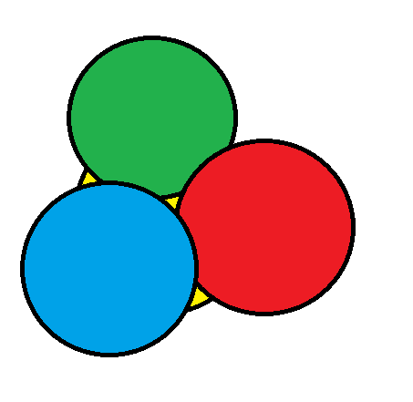
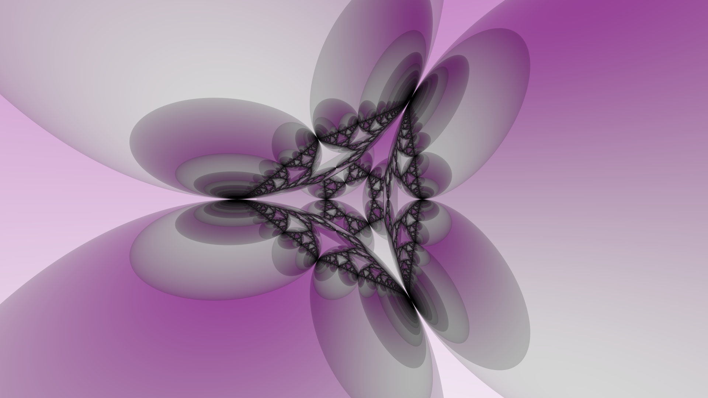
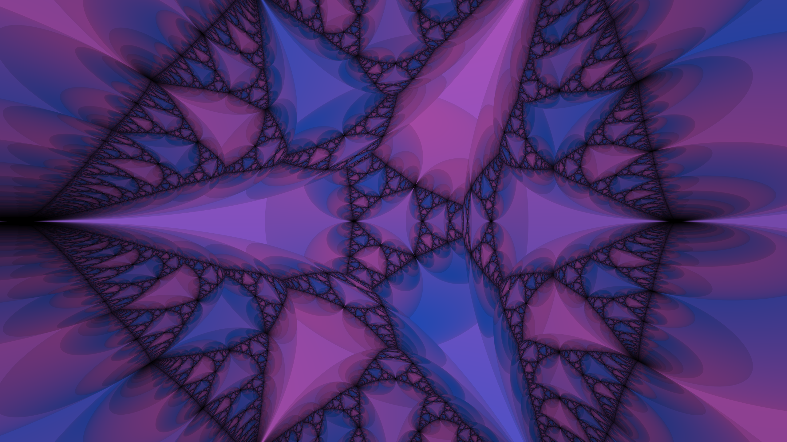

# ray tracer

### Author: Zane Globus-O'Harra

This is my final project for CS 441: Introduction to Computer Graphics.
My goal is to implement a ray tracer such that it can render the 
following:

- spheres,
- mirrors (reflections),
- glass objects (refractions),
- multiple light sources,
- shadows,
- diffuse light (we'll see if we get there or not),
- etc.

My minimum goal is to create a scene with some sort of place as a floor
(perhaps the classic checkerboard), and to render a few spheres.

## References

- The Ray Tracer Challenge by Jamis Buck
- raytracing.github.io by Peter Shirley
- Ray Tracing Tutorial by the Codermind Team
- https://en.wikipedia.org/wiki/Ray_tracing_(graphics)

## Inspiration

In Willamette Hall there is (or used to be--I don't know if it is still
there) a display case that contained 4 chrome balls arranged in a
3-sided pyramid shape (see below).

There were purple colored lights pointing into the gaps that were formed
around the sides of this "pyramid", but one side was left open for an
observer to look into. Looking in, you would see the most wonderful
fractal shape, created by the many reflections in the center of the
spheres, and along the surfaces of the spheres where they touched each
other. 

When I was creating my ray tracer, I always had that image in mind. I
was able to create a scene made of the four spheres, and position the
camera in such a way to look into the center, creating the resulting
image:

This image is made using 256 samples per pixel and a maximum ray depth
of 16. I still wanted to see more of the beautiful fractal reflections,
so I created another image:

I changed around the colorscheme a bit, moved the camera to be a bit
closer, and in return I get this beautiful scene.

I also created a movie! If you go to `img/out6.mp4` (there are other `mp4`
files, but I think `out6.mp4` is the best), you will see a movie made
out of 200 frames. The camera starts far away from the sphere and slowly
moves towards the center. At the same time, the camera field of view changes
from 20 degrees to 70 degrees, widening the fov, and creating a cool
"move close, zoom out" effect.

## Goals (did I meet them?)
Yes, I did meet (most of) my goals:

- spheres: seeing as they are the primitive object in ray tracing, they
  are obviously implemented.
- mirrors (reflections): reflections are also implemented recursively,
  which allowed me to create the scenes above.
- glass objects (refractions): glass objects are also implemented (see `img/out_18.ppm`)
- multiple light sources: alas! multiple light sources are not
  implemented. Instead of having light sources, I have any ray that does
  not hit an object in the scene (i.e., it flies off to infinity) gain a
  constant color determined by the main rendering function. This is how
  I made the blue/magenta color gradients in some of the above scenes.
  Over spring break (or whenever I have free time) I hope to implement
  actual light sources. 
- shadows: yes, shadows are implemented (they can also be seen in
  `img/out_18.ppm` around where the spheres touch the ground).
- diffuse light (we'll see if we get there or not): Yes! diffuse light
  is implemented. However, each ray when hitting a diffuse surface
  scatters only in one direction, so it is a sort of approximation. 
- Sampling: Multiple samples per pixel were implemented, this allowed me
  to reduce noise in the images and have some form of anti-aliasing.

Overall, I am proud of what I have made. There is plenty of information
fo the internet about creating ray tracers, and even with the resources and
tutorials that I found, I still wanted to understand all the code I was
writing. And I would say that I put in at least 20 hours just in coding
and understanding the math behind the code (as well as many additional
hours spent rendering the frames for the videos I made).